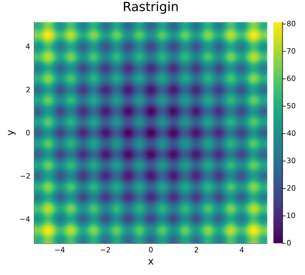
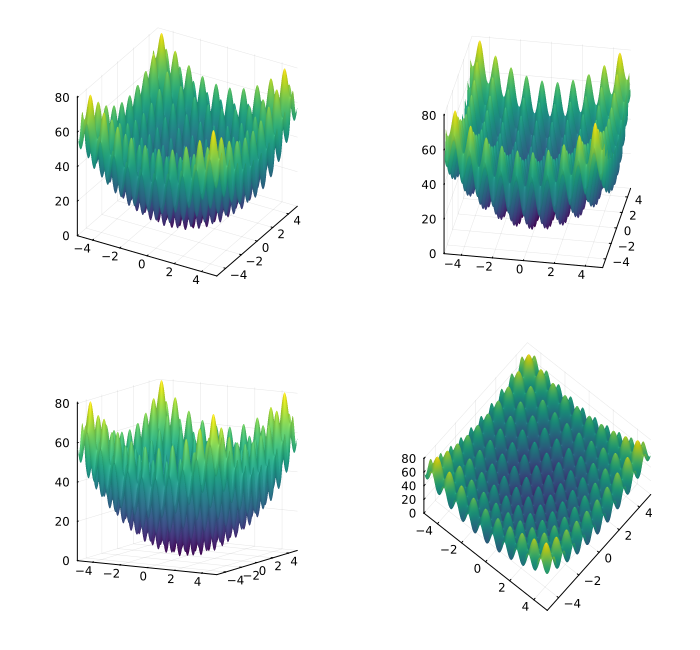

# Differential Evolution and Rastrigin

## Introduction

Differential Evolution is a global minimization algorithm (see Storn & Price, 1997), which iteratively generates new candidate solutions based on the goodness-of-fit of previous populations. I regularly use this algorithm to fit the computational models I run for my studies on working memory. Its main advantages include: (1) its versatility, as it can be applied to a wide range of problems, and (2) avoiding falling into local minima.

The purpose of the present project is to test the efficiency of this algorithm against a benchmark function: Rastrigin.

## Differential Evolution

The standard algorithm is implemented by following these steps:
1. Initialize a population of individuals $NP$, generally set to $10n$, with $$n$$ being the number of parameters of the to-be-fitted function.
2. Evaluate the goodness-of-fit of each individual in the population.
3. Generate a new population of individuals.
* For each individual in the old population, select three individuals from the old population at random and combine them.
* If this new individual minimizes the objective function, replace it by the old individual.
4. If the stopping criterion is met, terminate the simulation. If not, go back to step 2.

## Rastrigin

The Rastrigin function is a mathematical benchmark considered particularly challenging to minimize due to its numerous local minima. Its parameters are bounded between -5.12 and 5.12. The Rastrigin function has its global minimum at $x = 0.0$ with $f(x)=0.0$. The function is written as:

$$ f(x) = An + \sum_{i=1}^n [x_{i}^{2} - A cos(2 \pi x_{i})] $$

With a = 10. The figure below shows a heatmap of the Rastrigin function on a two-dimensional space. Darker colors indicate smaller error values. 

And here is a 3D representation to help visualization:

The function depicted above has two dimensions. If we make a parallel with a situation in which we try to find the global minimum of a model, this corresponds to a case where the model has two free parameters. However, in practice, models can have many more free parameters. The two-dimensional Rastrigin function was chosen only for illustrative purposes. The function can be extended to have as many dimensions as we want it to.

## Method & results

The 8-dimensional Rastrigin function was fitted using the Differential Evolution algorithm. I chose this number of dimensions because it corresponds to the number of dimensions I work with on a daily basis. For this simulation, I set the number of individuals in the population to $15n$. For a 8-dimensional problem, this gives 120 individuals per population. I used a stopping criterion in which the algorithm stops once the standard deviation of parameter values from individuals in the population falls below $10^{-6}$ (Zielinski et al., 2006).

To get a more comprehensive view of the algorithm's performance, the fit was repeated 1,000 times, leading to a distribution of goodness-of-fit.

## Results & conclusion

The figure below shows the distribution of errors produced by the 1,000 fits (left and middle panels) as well as the distribution of standard deviatons reached once the algorithm stops (right panel). The middle panel shows the error on a log scale, as the error distribution is strongly skewed, making the visualization process easier. As can be seen, the algorithm gets very close to the optimal solutions in most cases, as the error is close to 0.0 in the vast majority of the simulations.

Differential Evolution provides a simple but efficient way of finding very good parameter values for a very complex problem, such as the Rastrigin function. By extension, I expect this algorithm to be particularly efficient to fit a model to empirical data, as it is commonly done in computational modeling of human cognition.
